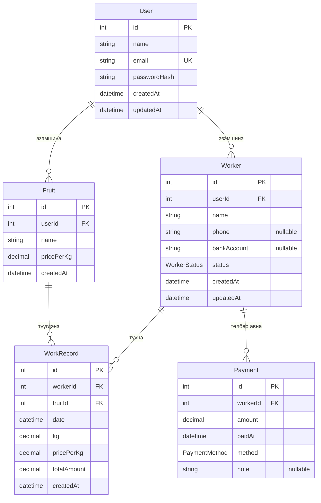

# Ургац хураалтын систем — Бизнесийн шаардлагын баримт бичиг (BRD) ба Байгууллагын харилцааны диаграм (ERD)

**Баримт бичгийн төрөл:** Бизнесийн шаардлагын баримт бичиг (Business Requirements Document) ба Байгууллагын харилцааны диаграм (Entity-Relationship Diagram)  
**Эх сурвалж:** Төслийн эх код (`prisma/schema.prisma`, `app/lib/*`, `app/dashboard/*`, `middleware.ts`)  
**Хэл:** Монгол  
**Анхаарах зүйл:** Энэхүү баримт бичиг зөвхөн хэрэгжсэн функц, схемийг тусгана. Кодод байхгүй зүйлийг зохиоогүй бөгөөд тодорхойгүй зүйлийг тусгайлан тэмдэглэсэн.

---

# Хэсэг 1. Бизнесийн шаардлагын баримт бичиг (BRD)

## 1. Төслийн тойм ба зорилго

### 1.1. Тойм

**Ургац хураалтын систем** (UI нэршлийн дагуу; техникийн нэр: `fruit-picker`) нь ургац хураалтын үйл ажиллагааг дижитал бүртгэх веб систем юм. Систем нь:

- түүгч (ажилтан) бүртгэх,
- ургацын төрөл ба кг тутам үнэ (тариф) тохируулах,
- өдрийн түүлтийг кг-аар бүртгэх,
- төлбөр олгох/бүртгэх,
- хугацаагаар шүүж нэгтгэн харах, тайлан гаргах

зэрэг үйлдлүүдийг нэг хэрэглэгчийн (ферм/аж ахуй) өгөгдлийн хүрээнд дэмжинэ.

Технологийн үндэс (кодоос):

| Зүйл | Хэрэгжүүлэлт |
|------|----------------|
| Фреймворк | Next.js (App Router) |
| Өгөгдлийн сан | PostgreSQL (Prisma ORM) |
| Серверийн үйлдэл | Next.js Server Actions (`'use server'`) |
| REST/GraphQL API | **Кодод тодорхойлогдоогүй** (тусдаа HTTP API endpoint байхгүй) |
| Нэвтрэлт | Cookie дээрх HMAC гарын үсэгтэй сесс (`farm_session`, 14 хоног) |

### 1.2. Бизнесийн зорилго

Кодод хэрэгжсэн функцээс хамааруулан дараах зорилгыг дэмжинэ:

1. Ургац хураалтын **өдөр тутмын түүлтийг** ажилтан, ургацын төрлөөр бүртгэх.
2. Ургацын **кг үнэ × авсан кг**-аар төлбөрийн дүнг тооцоолох.
3. Ажилтанд олгосон **төлбөр** болон үлдэгдлийг хянах.
4. Жил/сар/хугацаагаар **нэгтгэл, график, тайлан** харах.
5. Хэрэглэгч бүрийн өгөгдлийг **тусгаарлах** (`userId`-аар scope хийсэн multi-tenant загвар).

### 1.3. Асуудлын томъёолол

Гараар (цаас/Excel) түүлт, тариф, төлбөрийг хөтлөхөд:

- өдөр бүрийн кг, үнэ, төлбөрийн зөрүүг алдах,
- ажилтан/ургацаар нэгтгэхэд цаг зарцуулах,
- үлдэгдэл (төлөх ёстой дүн) тодорхой бус болох

зэрэг эрсдэл үүсдэг. Энэхүү систем нь эдгээр бүртгэлийг төвлөрүүлэн, автомат тооцоололтойгоор хадгална.

*Тайлбар:* Асуудлын томъёолол нь кодын функциональ хамрах хүрээнээс гаргасан дүгнэлт бөгөөд тусдаа хэрэглэгчийн судалгааны файл **кодод тодорхойлогдоогүй**.

---

## 2. Хамрах хүрээ (Scope)

### 2.1. Хамрах хүрээнд багтсан (In scope)

Кодод хэрэгжсэн модулиуд:

| Модуль | Маршрут / үйлдэл | Тайлбар |
|--------|------------------|---------|
| Бүртгэл/нэвтрэлт | `/` | Бүртгүүлэх, нэвтрэх |
| Dashboard | `/dashboard` | Хугацааны нэгтгэл, график, шүүлт |
| Түүгчид | `/dashboard/workers` | CRUD, дэлгэрэнгүй |
| Өдрийн түүлт | `/dashboard/work-records` | CRUD |
| Төлбөр | `/dashboard/payments` | CRUD, ажилтны үлдэгдэл |
| Ургацын тариф | `/dashboard/crops` | CRUD (DB entity: `Fruit`) |
| Тайлан | `/dashboard/reports` | Жил/сар, тооцооны шүүлт, экспорт |
| Тохиргоо | `/dashboard/settings` | Нууц үг солих, хэрэглэгчийн мэдээлэл |

### 2.2. Хамрах хүрээнээс гадуур (Out of scope / кодод байхгүй)

Дараах зүйлс **кодод хэрэгжээгүй** тул scope-оос гадуур гэж үзнэ:

- Олон шатлалт эрх (Admin / Manager / Worker гэх мэт role hierarchy)
- Түүгч өөрөө нэвтэрч өөрийн түүлт харах портал
- Нэхэмжлэх, НӨАТ, банкны API интеграци
- Мэдэгдэл (email/SMS/push)
- Олон хэлний (i18n) систем тохиргоо — UI монгол тексттэй боловч i18n framework **кодод тодорхойлогдоогүй**
- Тусдаа REST API documentation / OpenAPI
- Нөөцлөлт, audit log хүснэгт

---

## 3. Оролцогч талууд (Stakeholders)

| Оролцогч | Кодод тусгагдсан эсэх | Тайлбар |
|----------|------------------------|---------|
| Ферм/аж ахуйн эзэн (бүртгэлтэй хэрэглэгч) | Тийм | `User` — системд нэвтэрч бүх өгөгдлийг удирдана |
| Түүгч (ажилтан) | Өгөгдлийн объект | `Worker` — нэвтрэх эрхгүй, зөвхөн бүртгэлийн субъект |
| Системийн админ (платформын) | **Кодод тодорхойлогдоогүй** | |
| Гадаад систем (банк, нягтлан) | **Кодод тодорхойлогдоогүй** | |

---

## 4. Хэрэглэгчийн үүрэг ба хариуцлага (User roles)

Системд **нэг л нэвтрэх үүрэг** байна: бүртгэлтэй `User`.

### 4.1. User (эзэмшигч / оператор)

**Хариуцлага (кодоор зөвшөөрөгдсөн):**

- Өөрийн бүртгэлээр нэвтрэх, гарах, нууц үг солих
- Зөвхөн өөрийн `userId`-тай `Worker`, `Fruit` болон тэдгээртэй холбоотой `WorkRecord`, `Payment` харах/засах
- Түүлт, төлбөр, тариф, тайлан удирдах

**Хязгаарлалт:**

- Өөр `User`-ийн өгөгдөлд хандах боломжгүй (query/action бүр `userId` / `worker: { userId }` шүүлттэй)
- Role-based permission matrix **кодод тодорхойлогдоогүй** — бүх нэвтэрсэн хэрэглэгч өөрийн дата дээр бүрэн эрхтэй

### 4.2. Worker

Нэвтрэх credential **байхгүй**. Зөвхөн `Worker` entity хэлбэрээр хадгалагдана (нэр, утас, данс, статус).

---

## 5. Функциональ шаардлага (Functional Requirements)

### 5.1. Нэвтрэлт ба бүртгэл

| ID | Шаардлага | Эх сурвалж |
|----|-----------|------------|
| FR-AUTH-01 | Имэйл + нууц үгээр нэвтрэнэ | `loginAction` |
| FR-AUTH-02 | Нэр, имэйл, нууц үгээр бүртгүүлнэ (нууц үг ≥ 6 тэмдэгт, давталт шалгана) | `registerAction` |
| FR-AUTH-03 | Амжилттай нэвтрэлтийн дараа `/dashboard` руу шилжинэ | auth + middleware |
| FR-AUTH-04 | Нэвтээгүй хэрэглэгч `/dashboard/*` руу орохыг `/` руу чиглүүлнэ | `middleware.ts` |
| FR-AUTH-05 | Нэвтэрсэн хэрэглэгч `/` дээр байвал `/dashboard` руу чиглүүлнэ | `middleware.ts` |
| FR-AUTH-06 | Гарах үед сесс устгана | `logoutAction` |
| FR-AUTH-07 | Одоогийн нууц үгийг баталгаажуулж шинэ нууц үг тохируулна; амжилттай бол сесс шинэчлэгдэнэ | `changePasswordAction` |
| FR-AUTH-08 | Нууц үг scrypt-ээр hash хийгдэнэ | `password.ts` |

### 5.2. Түүгч (Worker)

| ID | Шаардлага | Эх сурвалж |
|----|-----------|------------|
| FR-WRK-01 | Түүгч үүсгэх: нэр (заавал), утас, банкны данс, статус (`ACTIVE`/`INACTIVE`) | `createWorker` |
| FR-WRK-02 | Ижил нэр эсвэл утас (case-insensitive) давхардахаас сэргийлнэ | `workerAlreadyExists` |
| FR-WRK-03 | Түүгч засварлах / устгах | `updateWorker`, `deleteWorker` |
| FR-WRK-04 | Түүгчийг устгахдаа холбоотой `WorkRecord` эсвэл `Payment` байвал устгахыг хориглоно | `deleteWorker` |
| FR-WRK-05 | Түүгчийн дэлгэрэнгүй: үлдэгдэл, түүлтийн тойм | `workers/[id]` |

### 5.3. Ургацын тариф (Fruit / UI: ургац)

| ID | Шаардлага | Эх сурвалж |
|----|-----------|------------|
| FR-CRP-01 | Ургац үүсгэх: нэр, `pricePerKg` | `createFruit` |
| FR-CRP-02 | Ижил нэртэй ургац (user дотор, case-insensitive) давхардуулахгүй | `createFruit`/`updateFruit` |
| FR-CRP-03 | Засварлах / устгах | `updateFruit`, `deleteFruit` |
| FR-CRP-04 | Холбоотой түүлт байвал ургац устгахыг хориглоно | `deleteFruit` |
| FR-CRP-05 | Ургацын дэлгэрэнгүй түүлтийн тойм | `crops/[id]` |

### 5.4. Өдрийн түүлт (WorkRecord)

| ID | Шаардлага | Эх сурвалж |
|----|-----------|------------|
| FR-WR-01 | Түүлт үүсгэх: ажилтан, ургац, огноо/цаг, кг; үнэ хоосон бол ургацын `pricePerKg` авна | `createWorkRecord` |
| FR-WR-02 | `totalAmount = kg × pricePerKg` (2 орон хүртэл) | `createWorkRecord`/`updateWorkRecord` |
| FR-WR-03 | Ажилтан ба ургац нь тухайн хэрэглэгчид харьяалагдах ёстой | ownership check |
| FR-WR-04 | Засварлах / устгах | `updateWorkRecord`, `deleteWorkRecord` |
| FR-WR-05 | Өнөөдрийн түүлтийн тойм харуулна | `work-records` + `section-stats` |

### 5.5. Төлбөр (Payment)

| ID | Шаардлага | Эх сурвалж |
|----|-----------|------------|
| FR-PAY-01 | Төлбөр бүртгэх: ажилтан, дүн (>0), `paidAt`, арга (`CASH`/`BANK`), тэмдэглэл | `createPayment` |
| FR-PAY-02 | Ажилтны үлдэгдэл = Σ(түүлтийн totalAmount) − Σ(төлбөр) | `payment-stats` |
| FR-PAY-03 | Төлбөр засварлах / устгах | `updatePayment`, `deletePayment` |
| FR-PAY-04 | Ажилтнаар төлбөрийн түүх харна | `payments/workers/[id]` |

### 5.6. Dashboard ба тайлан

| ID | Шаардлага | Эх сурвалж |
|----|-----------|------------|
| FR-DSH-01 | Шүүлт: жил, сар, огноо, сүүлийн 7/14 хоног, from–to, ургац, ажилтан | `DashboardFilter` |
| FR-DSH-02 | Шүүлтгүй үед график/нэгтгэл сүүлийн 7 хоногоор | `dashboard/page.tsx` |
| FR-DSH-03 | Зөвхөн жил сонгосон үед сарын багана график | `MonthlyHarvestChart` |
| FR-DSH-04 | Сар эсвэл хугацааны муж үед өдөр бүрийн график | `DailyHarvestChart` |
| FR-DSH-05 | Ургац/ажилтнаар нэгтгэл хүснэгт | `getFruitSummaries`, `getWorkerSummaries` |
| FR-RPT-01 | Жил (заавал), сар (сонголттой) тайлан | `getReportStats` |
| FR-RPT-02 | Тооцооны шүүлт: бүгд / тооцоотой / тооцоогүй | `report-settlement.ts` |
| FR-RPT-03 | PDF/CSV экспорт | `reports/export-buttons.tsx` |

---

## 6. Функциональ бус шаардлага (Non-functional Requirements)

Кодоос шууд харагдах эсвэл тодорхой хэрэгжсэн зүйлс:

| ID | Ангилал | Шаардлага | Тэмдэглэл |
|----|---------|-----------|-----------|
| NFR-01 | Аюулгүй байдал | Нууц үг scrypt + `timingSafeEqual` | `password.ts` |
| NFR-02 | Аюулгүй байдал | Сесс httpOnly cookie, HMAC; production-д `AUTH_SECRET` заавал | `session-token.ts`, `session.ts` |
| NFR-03 | Аюулгүй байдал | Өгөгдөл `userId`-аар тусгаарлагдана | data/actions/stats |
| NFR-04 | Хэрэглэгчийн туршлага | Responsive UI (desktop хүснэгт + mobile card) | `DataTableShell`, mobile components |
| NFR-05 | Найдвартай байдал | Устгах үйлдэлд холбоотой бүртгэл байвал business rule-аар татгалзана | delete actions |
| NFR-06 | Гүйцэтгэл | Тоон KPI (response time, concurrent users) | **Кодод тодорхойлогдоогүй** |
| NFR-07 | Боломжит байдал (availability) | SLA | **Кодод тодорхойлогдоогүй** |
| NFR-08 | Нөөцлөлт | Backup policy | **Кодод тодорхойлогдоогүй** (гадны DB платформоос хамаарна) |

---

## 7. Бизнесийн дүрэм (Business Rules)

| ID | Дүрэм | Хэрэгжүүлэлт |
|----|-------|--------------|
| BR-01 | Түүлтийн дүн = кг × кг үнэ | `WorkRecord.totalAmount` |
| BR-02 | Төлбөр үүсгэхэд үнэ оруулаагүй бол ургацын тарифын үнийг авна | `createWorkRecord` / `updateWorkRecord` |
| BR-03 | Ажилтны үлдэгдэл = нийт төлбөр (earned) − нийт төлсөн; сөрөг үлдэгдлийг UI-д “төлөх ёстой” гэж 0 хүртэл харуулж болно (`Math.max(0, …)` зарим газарт) | `payment-stats`, summaries |
| BR-04 | **Тооцоотой:** түүсэн кг > 0 ба үлдэгдэл (earned − paid) ≠ 0 | `isWorkerSettled` / `isFruitSettled` |
| BR-05 | **Тооцоогүй:** түүсэн кг > 0 ба үлдэгдэл яг 0 | мөн тэнд |
| BR-06 | Түүсэн кг = 0 бол тооцооны шүүлтэнд орохгүй | `filterReport*` |
| BR-07 | Түүгчийг устгахыг зөвхөн түүлт/төлбөргүй үед зөвшөөрнө | `deleteWorker` |
| BR-08 | Ургац устгахыг зөвхөн түүлтгүй үед зөвшөөрнө | `deleteFruit` |
| BR-09 | Dashboard дээр жимсээр шүүхэд төлсөн дүнг пропорциональ хуваарилж ойролцоолно (`allocatePaid`) | `dashboard-stats.ts` |
| BR-10 | Имэйл системд давхцахгүй (`User.email` unique) | schema + register |
| BR-11 | Сессийн хугацаа 14 хоног | `SESSION_DAYS` |

---

## 8. Үндсэн бизнесийн процессууд

### 8.1. Хэрэглэгч бүртгэх → нэвтрэх

1. `/` дээр бүртгүүлэх → `User` үүснэ (passwordHash).  
2. Сесс cookie тохируулагдана → `/dashboard`.  
3. Дараагийн хандалтад middleware сесс шалгана.

### 8.2. Тариф тохируулах

1. Ургац нэмэх (`Fruit`: нэр, `pricePerKg`).  
2. Шаардлагатай бол засварлах.

### 8.3. Түүгч бүртгэх

1. Ажилтан нэмэх.  
2. Статус `ACTIVE`/`INACTIVE` тохируулах.

### 8.4. Өдрийн түүлт бүртгэх

1. Ажилтан + ургац + огноо + кг сонгоно.  
2. Үнэ автомат эсвэл гараар.  
3. `totalAmount` тооцогдож хадгалагдана.

### 8.5. Төлбөр олгох

1. Ажилтны үлдэгдлийг харна.  
2. Төлбөр бүртгэнэ (`CASH`/`BANK`).  
3. Үлдэгдэл дахин тооцогдоно.

### 8.6. Хяналт ба тайлан

1. Dashboard-аар хугацаа шүүнэ.  
2. Тайлан хуудаснаас жил/сар, тооцооны байдлаар шүүж экспорт хийнэ.

---

## 9. Хэрэглээний тохиолдол (Use Cases)

### UC-01: Системд нэвтрэх

- **Үндсэн жүжигчин:** User  
- **Урьдчилсан нөхцөл:** Бүртгэлтэй байна  
- **Үндсэн урсгал:** Имэйл/нууц үг оруулах → баталгаажуулалт → dashboard  
- **Альтернатив:** Буруу нууц үг → алдааны мессеж

### UC-02: Түүгч бүртгэх

- **Үндсэн урсгал:** Форм бөглөх → хадгалах → жагсаалт  
- **Альтернатив:** Давхардсан нэр/утас → татгалзах

### UC-03: Ургацын тариф нэмэх/засах

- **Үндсэн урсгал:** Нэр, үнэ оруулах → хадгалах

### UC-04: Өдрийн түүлт бүртгэх

- **Урьдчилсан нөхцөл:** Дор хаяж нэг ажилтан, нэг ургац байна  
- **Үндсэн урсгал:** Сонголтууд + кг → `totalAmount` тооцоологдож хадгалагдана

### UC-05: Төлбөр бүртгэх

- **Урьдчилсан нөхцөл:** Ажилтан байна  
- **Үндсэн урсгал:** Дүн, огноо, арга оруулах → үлдэгдэл шинэчлэгдэнэ

### UC-06: Dashboard-аар хугацаа шүүх

- **Үндсэн урсгал:** Жил/сар/хоног/муж сонгох → график, нэгтгэл шинэчлэгдэнэ

### UC-07: Тайлан харах, экспортлох

- **Үндсэн урсгал:** Жил/сар, тооцооны шүүлт → хүснэгт/график → PDF эсвэл CSV

### UC-08: Нууц үг солих

- **Үндсэн урсгал:** Одоогийн + шинэ нууц үг → амжилттай бол сесс эргэнэ

### UC-09: Түүгч/ургац устгах

- **Альтернатив:** Холбоотой бүртгэлтэй бол устгах боломжгүй мессеж

---

## 10. Системийн хязгаарлалт ба таамаглал

### 10.1. Хязгаарлалт

1. Тусдаа public REST API байхгүй — зөвхөн Server Actions + App Router хуудсууд.  
2. Эрхийн загвар нь “нэг User = нэг түрээслэгч”, дэд эрх байхгүй.  
3. `WorkRecord`/`Payment` дээр `userId` багана байхгүй — тусгаарлалт `Worker`/`Fruit` харилцаагаар дамжина.  
4. UI “ургац”, DB entity нэр `Fruit` — нэршлийн зөрүү.  
5. Middleware зөвхөн `/` ба `/dashboard/:path*` matcher-тэй.

### 10.2. Таамаглал

1. Нэг бүртгэл нэг ферм/аж ахуйн өгөгдлийг удирдана.  
2. `DATABASE_URL`, production-д `AUTH_SECRET` орчны хувьсагч тохируулагдсан байна.  
3. Огнооны “өнөөдөр”/сүүлийн N хоногт локал цагийн бүс ашиглана (`toLocalDateKey`) — TZ тохиргооны тусгай entity **кодод тодорхойлогдоогүй**.  
4. Мөнгөний нэгж UI-д төгрөг (₮) гэж харагдана; currency entity **кодод тодорхойлогдоогүй**.

---

## 11. Системийн хандалтын цэгүүд (API / endpoints)

**REST API endpoint жагсаалт кодод байхгүй.**  
Харин дараах **Server Actions** нь бичих үйлдлийн интерфейс болно:

| Action | Зориулалт |
|--------|-----------|
| `loginAction`, `registerAction`, `logoutAction`, `changePasswordAction` | Auth |
| `createWorker`, `updateWorker`, `deleteWorker` | Түүгч |
| `createFruit`, `updateFruit`, `deleteFruit` | Ургац/тариф |
| `createWorkRecord`, `updateWorkRecord`, `deleteWorkRecord` | Түүлт |
| `createPayment`, `updatePayment`, `deletePayment` | Төлбөр |

Унших үйлдлүүд нь Server Component-уудаас `app/lib/data.ts`, `*-stats.ts` функцүүдийг шууд дуудна.

---

# Хэсэг 2. Байгууллагын харилцааны диаграм (ERD)

## 1. Entity жагсаалт (Prisma schema-аас)

### 1.1. `User`

| Атрибут | Төрөл | Түлхүүр / хязгаар | Тайлбар |
|---------|-------|-------------------|---------|
| id | Int | PK, autoincrement | |
| name | String | | |
| email | String | UNIQUE | |
| passwordHash | String | | |
| createdAt | DateTime | default now | |
| updatedAt | DateTime | @updatedAt | |

**Харилцаа:** `User` 1 — N `Worker`; `User` 1 — N `Fruit`

### 1.2. `Worker`

| Атрибут | Төрөл | Түлхүүр / хязгаар | Тайлбар |
|---------|-------|-------------------|---------|
| id | Int | PK | |
| userId | Int | FK → User.id, ON DELETE CASCADE, index | |
| name | String | | |
| phone | String? | optional | |
| bankAccount | String? | optional | |
| status | WorkerStatus | default ACTIVE | enum |
| createdAt | DateTime | | |
| updatedAt | DateTime | | |

**Харилцаа:** `Worker` N — 1 `User`; `Worker` 1 — N `WorkRecord`; `Worker` 1 — N `Payment`

### 1.3. `Fruit` (UI: ургац)

| Атрибут | Төрөл | Түлхүүр / хязгаар | Тайлбар |
|---------|-------|-------------------|---------|
| id | Int | PK | |
| userId | Int | FK → User.id, ON DELETE CASCADE, index | |
| name | String | | |
| pricePerKg | Decimal | | кг үнэ |
| createdAt | DateTime | | |

**Харилцаа:** `Fruit` N — 1 `User`; `Fruit` 1 — N `WorkRecord`  
**Анхаарах:** `updatedAt` **кодод/схемд тодорхойлогдоогүй**.

### 1.4. `WorkRecord`

| Атрибут | Төрөл | Түлхүүр / хязгаар | Тайлбар |
|---------|-------|-------------------|---------|
| id | Int | PK | |
| workerId | Int | FK → Worker.id, index | |
| fruitId | Int | FK → Fruit.id, index | |
| date | DateTime | index | түүлтийн огноо |
| kg | Decimal | | |
| pricePerKg | Decimal | | тухайн үеийн үнэ |
| totalAmount | Decimal | | кг×үнэ |
| createdAt | DateTime | | |

**Харилцаа:** `WorkRecord` N — 1 `Worker`; `WorkRecord` N — 1 `Fruit`  
**Анхаарах:** `userId` багана **байхгүй**; `onDelete` зан үйл Worker/Fruit талд schema дээр CASCADE гэж **тодорхойлогдоогүй** (default Restrict/NoAction — Prisma default).

### 1.5. `Payment`

| Атрибут | Төрөл | Түлхүүр / хязгаар | Тайлбар |
|---------|-------|-------------------|---------|
| id | Int | PK | |
| workerId | Int | FK → Worker.id, index | |
| amount | Decimal | | |
| paidAt | DateTime | default now | |
| method | PaymentMethod | default CASH | enum |
| note | String? | optional | |

**Харилцаа:** `Payment` N — 1 `Worker`  
**Анхаарах:** `userId`, `createdAt` **схемд тодорхойлогдоогүй**.

## 2. Enum төрлүүд

### `WorkerStatus`
- `ACTIVE`
- `INACTIVE`

### `PaymentMethod`
- `CASH` (UI: Бэлнээр)
- `BANK` (UI: Дансаар)

## 3. Кардиналитийн хураангуй

| Харилцаа | Кардиналити | Тайлбар |
|----------|-------------|---------|
| User → Worker | 1 : N | Нэг хэрэглэгч олон түүгчтэй |
| User → Fruit | 1 : N | Нэг хэрэглэгч олон ургац/тарифтай |
| Worker → WorkRecord | 1 : N | |
| Fruit → WorkRecord | 1 : N | |
| Worker → Payment | 1 : N | |
| WorkRecord ↔ Payment | **Шууд FK байхгүй** | Логик холбоо ажилтнаар дамжина; төлбөрийг тодорхой түүлттэй шууд холбох нь **кодод тодорхойлогдоогүй** |

## 4. ERD (Mermaid)

## 5. Логик (computed) ойлголтууд — DB хүснэгт биш

Дараах нь schema entity биш, хэрэглээний давхаргад тооцогдоно:

| Ойлголт | Томъёо / дүрэм |
|---------|----------------|
| Ажилтны earned | Σ `WorkRecord.totalAmount` |
| Ажилтны paid | Σ `Payment.amount` |
| Үлдэгдэл (balance) | earned − paid |
| Тооцоотой / тооцоогүй | BR-04, BR-05 |

---

## 6. Баримт бичгийн хязгаарлалт

1. Энэхүү BRD/ERD нь зөвхөн шинжилгээ хийсэн эх код дээр суурилсан.  
2. Бизнесийн асуудлын томъёолол, stakeholder жагсаалтын зарим хэсэг нь кодоос шууд гарахгүй тул **таамаглал/дүгнэлт** гэж тэмдэглэсэн.  
3. Гүйцэтгэлийн тоон шаардлага, эрх зүйн шаардлага **кодод тодорхойлогдоогүй**.  
4. DB физик нэр (`Fruit`) ба UI нэр (“ургац”) зөрүүтэй байгааг мэдээлэл алдагдуулахгүйн үүднээс тусгасан.

---

**Баримт бичгийн төгсгөл**
