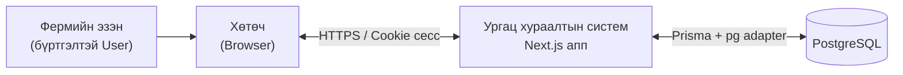
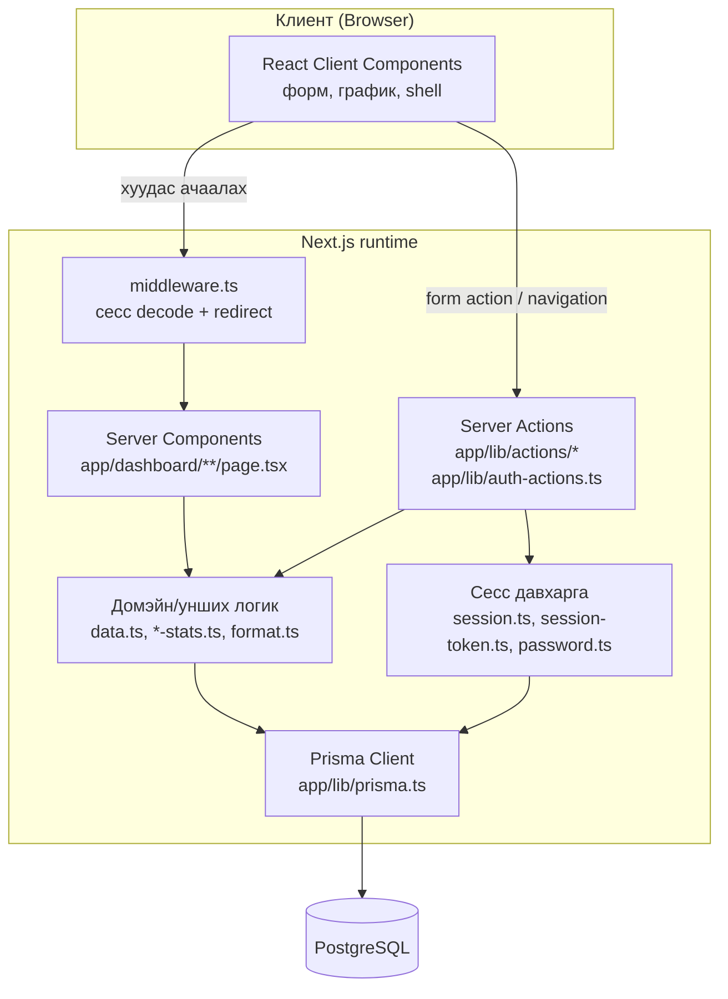
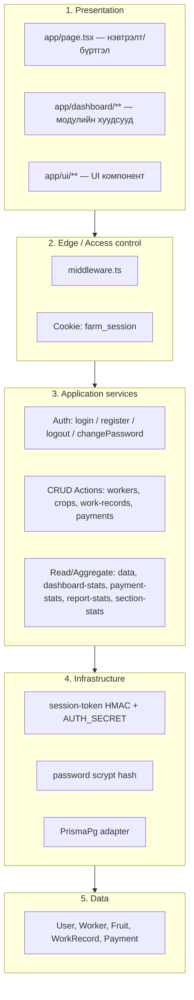
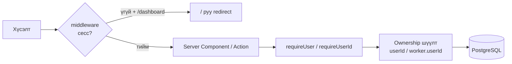

# Ургац хураалтын систем — Системийн архитектур (System Architecture)

**Эх сурвалж:** Төслийн эх код (`app/`, `middleware.ts`, `prisma/`, `package.json`)  
**Архитектурын хэв:** Monolithic full-stack веб аппликейшн (Next.js App Router)  
**Анхаарах:** Зөвхөн хэрэгжсэн бүтэц; байхгүй давхарга/үйлчилгээг зохиогоогүй.

---

## 1. Архитектурын тойм

Систем нь **нэг Next.js аппликейшн** дотор UI, бизнес логик, өгөгдлийн хандалтыг нэгтгэсэн. Тусдаа backend microservice, REST API gateway, message queue **кодод тодорхойлогдоогүй**.

| Давхарга | Технологи | Үүрэг |
|----------|-----------|--------|
| Presentation | React 19, Tailwind CSS 4, App Router хуудсууд | UI, форм, график |
| Application / Edge | Next.js Middleware | Сесс шалгах, чиглүүлэх |
| Application / Server | Server Components + Server Actions | Бизнес логик, CRUD, auth |
| Domain / Data access | Prisma Client 7 + `@prisma/adapter-pg` | ORM query |
| Persistence | PostgreSQL (`DATABASE_URL`) | Өгөгдөл хадгалах |

---

## 2. Өндөр түвшний контекст диаграм (C4 — Context)



**Гаднах систем:** Банк, email, SMS, тусдаа API клиент — **кодод тодорхойлогдоогүй**.

---

## 3. Контейнер / бүтцийн диаграм



---

## 4. Логик давхаргууд (Logical layers)



---

## 5. Хүсэлтийн урсгал (Request flow)

### 5.1. Хуудас үзэх (унших)

1. Хөтөч → `GET /dashboard/...`
2. `middleware` cookie-аас сесс decode хийнэ; байхгүй бол `/` руу redirect
3. Server Component `requireUser` / `requireUserId` ашиглана
4. `data.ts` эсвэл `*-stats.ts` → Prisma → PostgreSQL
5. HTML/RSC payload буцаана; шаардлагатай хэсэг Client Component hydrate хийнэ

### 5.2. Бичих үйлдэл (мутаци)

1. Client form → Server Action (`'use server'`)
2. `requireUserId()` — эзэмшлийн шалгалт
3. Валидаци + Prisma `create`/`update`/`delete`
4. `revalidatePath(...)` — холбоотой хуудсыг шинэчилнэ

### 5.3. Нэвтрэлт

1. `loginAction` / `registerAction`
2. Нууц үг шалгах / hash хийх
3. `createSession` → httpOnly cookie `farm_session` (14 хоног)
4. Redirect `/dashboard`

---

## 6. Модулийн бүтэц (Application modules)

| Модуль | UI | Actions / Logic | Өгөгдөл |
|--------|----|-----------------|---------|
| Auth | `app/ui/auth`, `/` | `auth-actions.ts` | `User` |
| Dashboard | `app/dashboard/page.tsx`, `ui/dashboard/*` | `dashboard-stats.ts`, `dashboard-url.ts` | WorkRecord, Payment (aggregate) |
| Түүгчид | `dashboard/workers`, `ui/workers` | `actions/workers.ts` | `Worker` |
| Өдрийн түүлт | `dashboard/work-records` | `actions/work-records.ts` | `WorkRecord` |
| Төлбөр | `dashboard/payments` | `actions/payments.ts`, `payment-stats.ts` | `Payment` |
| Ургацын тариф | `dashboard/crops` | `actions/crops.ts` | `Fruit` |
| Тайлан | `dashboard/reports` | `report-stats.ts`, `report-settlement.ts` | aggregate |
| Тохиргоо | `dashboard/settings` | `changePasswordAction` | `User` |

**Multi-tenant загвар:** Бүх бизнес өгөгдөл `User.id` (`userId`) scope-оор тусгаарлагдана. Тусдаа tenant сервис **байхгүй**.

---

## 7. Аюулгүй байдлын архитектур



| Механизм | Хэрэгжүүлэлт |
|----------|----------------|
| Сесс | HMAC гарын үсэгтэй payload, cookie `farm_session` |
| Нууц үг | scrypt hash (`password.ts`) |
| Production secret | `AUTH_SECRET` заавал |
| Өгөгдлийн тусгаарлалт | Query/action бүрт `userId` |
| Role RBAC | **Кодод тодорхойлогдоогүй** (нэг User = бүрэн эрх өөрийн дата дээр) |

---

## 8. Өгөгдлийн архитектур (товч)

- **ORM:** Prisma 7  
- **Driver adapter:** `@prisma/adapter-pg` + `pg`  
- **Холболт:** `process.env.DATABASE_URL`  
- **Миграци:** `prisma/migrations/`  
- **Entity:** User → Worker/Fruit → WorkRecord/Payment (дэлгэрэнгүйг `docs/BRD-ERD.md` үзнэ үү)

---

## 9. Байршуулалт (Deployment) — кодоос харагдах зүйл

| Зүйл | Төлөв |
|------|--------|
| Runtime | Node.js дээр `next start` (скриптээс) |
| Hosting платформ | **Кодод тодорхойлогдоогүй** (Vercel гэх мэт тохиргооны файл байхгүй) |
| Орчны хувьсагч | `DATABASE_URL`, production-д `AUTH_SECRET` |
| CDN / load balancer | **Кодод тодорхойлогдоогүй** |

---

## 10. Технологийн стек

```
Browser (React 19)
    ↓
Next.js 16 (App Router + Middleware + Server Actions)
    ↓
Prisma Client 7 + PrismaPg adapter
    ↓
PostgreSQL
```

**UI:** Tailwind CSS 4  
**Хэл:** TypeScript  
**Package manager:** pnpm  

---

## 11. Архитектурын шийдвэр ба хязгаарлалт

1. **Monolith + Server Actions** — тусдаа API сервер байхгүй; энгийн CRUD веб апп-д тохиромжтой.  
2. **RSC-first унших** — ихэнх хуудас сервер дээр өгөгдөл татна.  
3. **Cookie сесс** — JWT provider / OAuth **кодод тодорхойлогдоогүй**.  
4. **Нэг процесс** — background worker, queue, cron **кодод тодорхойлогдоогүй**.  
5. UI “ургац” / DB `Fruit` — нэршлийн зөрүү архитектур биш, domain naming зөрүү.

---

**Баримт бичгийн төгсгөл**
